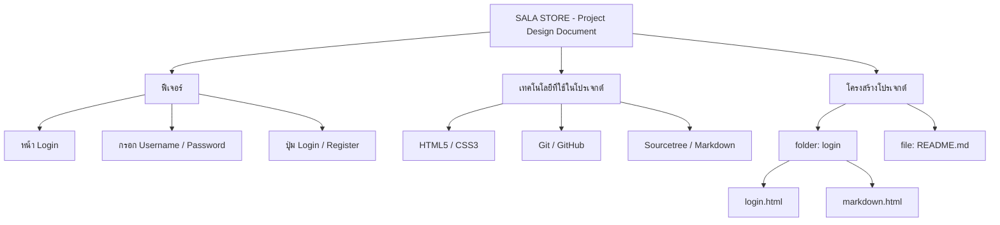

# SALA STORE - Project Design Document
# Project of CSI204 SUMMER SEMESTER 3/2568

## รายละเอียดโปรเจกต์

ระบบ E - Commerce สำหรับร้านขายเสื้อผ้าแบรนด์ SALA รองรับ 3 บทบาทผู้ใช้งาน Customer . Staff , Admin

## USER REQUITEMENT

### CUSTOMER

- เพิ่มสินค้าลงตะกร้า
- ค้นหาสินค้า
- log in / register
- check out
- buy history
- ยื่น ticket support (ขอความช่วยเหลือ/ติดต่อ support)

### ADMIN

- add สินค้า
- delete สินค้า
- เพิ่มหมวดหมู่สินค้า
- แก้ไขสินค้า
- จัดการข้อมูลลูกค้า
- dashboard

### SUPPORT

- ตอบ ticket ลูกค้า


## โครงสร้างโปรเจกต์

```text
Project-Documentation-with-GitHub
│
├── login
│   └── login.html
│   └── markdown.html
│
└── README.md
```

## MERMAID ยังไม่แก้ไขเนื้อหาอะไรเลย


## ผู้จัดทำ

- ชื่อ : นางสาวภทรพร แซ่ลี้
- รหัสนักศึกษา : 67176203