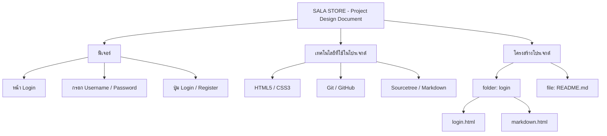

# SALA STORE - Project Design Document
# Project of CSI204 SUMMER SEMESTER 3/2568

## Project Details (รายละเอียดโปรเจกต์)

ระบบ E - Commerce สำหรับร้านขายเสื้อผ้าแบรนด์ SALA รองรับ 3 บทบาทผู้ใช้งาน Customer . Staff , Admin


## Background and Significance (ที่มาและความสำคัญของโปรเจกต์)

ปัจจุบันเทคโนโลยีและอินเทอร์เน็ตมีบทบาทสำคัญต่อธุรกิจการค้า โดยเฉพาะระบบ E-Commerce ที่ช่วยเพิ่มความสะดวกในการซื้อขายสินค้า ทำให้ลูกค้าสามารถเข้าถึงสินค้าได้ทุกที่ทุกเวลา ส่งผลให้ธุรกิจจำเป็นต้องปรับตัวให้สอดคล้องกับพฤติกรรมของผู้บริโภคที่หันมาซื้อสินค้าออนไลน์มากขึ้น

ร้านขายเสื้อผ้าแบรนด์ SALA มีความต้องการพัฒนาช่องทางการจำหน่ายสินค้าให้มีประสิทธิภาพมากขึ้น รวมถึงช่วยจัดการข้อมูลสินค้าและคำสั่งซื้ออย่างเป็นระบบ จึงมีแนวคิดในการพัฒนาระบบ E-Commerce สำหรับรองรับผู้ใช้งาน 3 บทบาท ได้แก่ Customer, Staff และ Admin โดย Customer สามารถเลือกซื้อและติดตามคำสั่งซื้อได้ Staff สามารถจัดการคำสั่งซื้อและข้อมูลการขาย ส่วน Admin สามารถดูแลและบริหารจัดการระบบทั้งหมด

ระบบดังกล่าวจะช่วยเพิ่มประสิทธิภาพในการดำเนินงาน ลดความซ้ำซ้อนในการจัดการข้อมูล และช่วยเพิ่มความสะดวกให้ทั้งผู้ใช้งานและการบริหารจัดการภายในร้าน


## Project Objectives (วัตถุประสงค์ของโปรเจกต์)

- เพื่อพัฒนาระบบ E-Commerce สำหรับร้านขายเสื้อผ้าแบรนด์ SALA  ให้สามารถซื้อขายสินค้าออนไลน์ได้อย่างมีประสิทธิภาพ
- เพื่ออำนวยความสะดวกให้ลูกค้า (Customer) ในการค้นหา เลือกซื้อสินค้า และติดตามสถานะคำสั่งซื้อ
- เพื่อช่วยให้พนักงาน (Staff) สามารถจัดการปัญหาที่เกิดขึ้นจากคำสั่งซื้อของลูกค้าและจัดการข้อมูลการขายได้อย่างเป็นระบบ
- เพื่อช่วยให้ผู้ดูแลระบบ (Admin) สามารถบริหารจัดการข้อมูลสินค้า ผู้ใช้งาน และระบบโดยรวมได้อย่างมีประสิทธิภาพ
- เพื่อลดความซ้ำซ้อนในการทำงานและเพิ่มประสิทธิภาพในการบริหารจัดการร้านค้า


## Documentation

USER REQUIREMENTS (docs/user-requirements.md)


## SYSTEM REQUIREMENTS (ความต้องการของระบบ)
ระบบ E-Commerce สำหรับร้านขายเสื้อผ้าแบรนด์ SALA ต้องรองรับผู้ใช้งาน 3 บทบาท ได้แก่ Customer, Staff และ Admin โดยมีความต้องการของระบบดังนี้

- Customer สามารถสมัครสมาชิก เข้าสู่ระบบ ค้นหาสินค้า ดูรายละเอียดสินค้า เพิ่มสินค้าในตะกร้า สั่งซื้อสินค้า ชำระเงิน และติดตามสถานะคำสั่งซื้อได้
- Staff สามารถตรวจสอบคำสั่งซื้อ อัปเดตสถานะการจัดส่ง และจัดการข้อมูลการขายได้
- Admin สามารถจัดการข้อมูลสินค้า เพิ่ม แก้ไข และลบสินค้า จัดการข้อมูลผู้ใช้งาน และตรวจสอบรายงานการขายได้
- ระบบต้องสามารถจัดเก็บข้อมูลสินค้า ข้อมูลลูกค้า และข้อมูลคำสั่งซื้ออย่างเป็นระบบ
- ระบบต้องมีการกำหนดสิทธิ์การเข้าถึงของผู้ใช้งานแต่ละประเภทเพื่อความปลอดภัยของข้อมูล


## FUNCTIONAL REQUIREMENTS (ความต้องการด้านฟังก์ชัน)


## Non-Functional Requirements  (ความต้องการที่ไม่ใช่ฟังก์ชัน)


## Prototype (ต้นแบบ)


## USERS (ผู้ใช้งาน)


## DATABASE (ฐานข้อมูล)


## SCOPE (ขอบเขตโปรเจกต์)


## Technologies Used (เทคโนโลยีที่ใช้)


## PAIN POINT (ปัญหาที่พบ)


## Project Structure (โครงสร้างโปรเจกต์)


```text
Project-Documentation-with-GitHub
│
├── login
│   └── login.html
│   └── markdown.html
│
└── README.md
```

## MERMAID โครง


## ผู้จัดทำ

- ชื่อ : นางสาวภทรพร แซ่ลี้
- รหัสนักศึกษา : 67176203